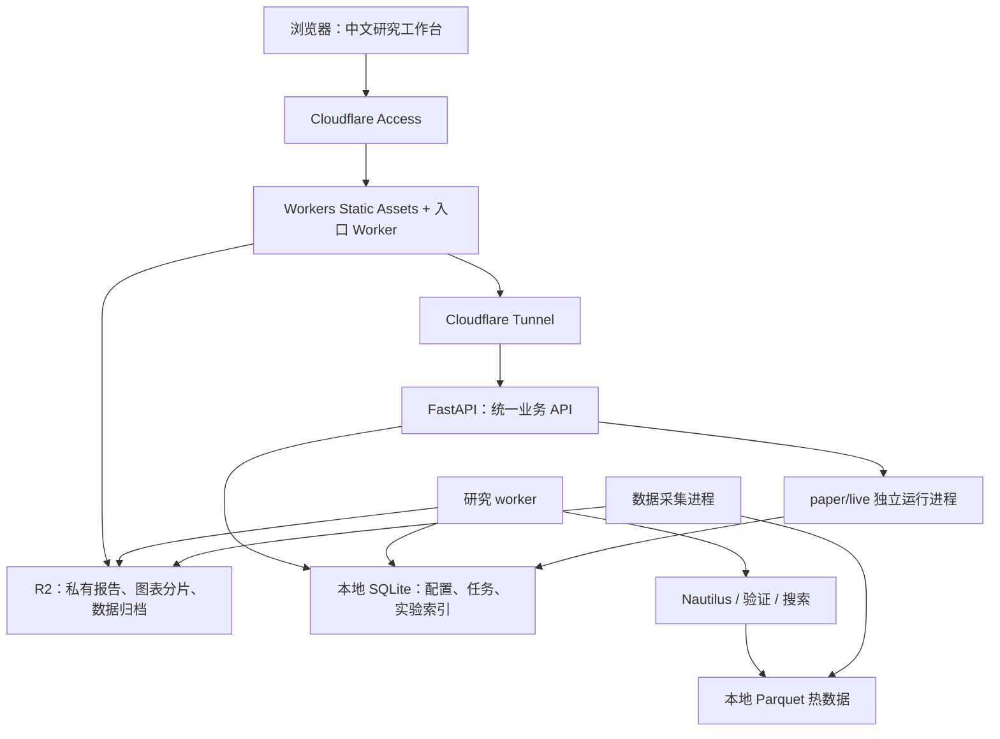

# QT 全量能力融合与 Cloudflare 研究工作台实施方案

日期：2026-09-07。基础仓库：`/Users/kwt/x/qt`。交付分支：`main`。

## 1. 目标与交付边界

把 qt、btc-qt、btc-quant 的全部现有算法、指标、信号、数据接入、研究、回测、比较、执行、风控、监控与研究资产迁入 qt，形成一个仓库、一套能力目录和一个中文 Web 工作台。包括 btc-quant 的 `.worktrees/multisource-evolution` 分支，不能仅检查 main。

使用顺序为：学习指标 → 理解规则 → 配置/编辑策略 → 历史回测 → 逐笔解释 → 单策略及组合比较 → 样本外验证 → 前向模拟 → 后续小额实盘。

本轮迁移包括模拟交易和原有实盘控制能力的实现与测试；默认运行研究模式，不启用真实交易，也不因某次回测盈利自动增加额度或频率。用户已经授权完成编码、验证，并将相关代码提交、推送到 main。网页需要实际部署到 Cloudflare；若账户权限、域名或运行资源阻塞，完成所有可执行工作并明确报告阻塞，不把配置文件当作已部署网站。

“全部迁移”不能只表示复制源码或登记名字：每项原有可执行能力都要有新位置、可调用入口和验证证据。外部付费数据缺失可以阻塞真实数据验证，但不能用空实现代替数据适配器。原项目中仅有设想的功能标注为规划资产，不冒充已实现能力。

## 2. 全量能力清单与迁移规则

先建立机器可读清单以及由清单生成的页面。每条记录包含：稳定 ID、类型、来源仓库/提交/文件/旧 ID、语义版本、新实现、Web/API/CLI 入口、必要数据、依赖、测试证据、迁移状态和数据验证状态。

迁移状态：待迁移、迁移中、已实现待验证、已验证、合并到等价能力。等价合并必须提供目标 ID 与对照测试。数据状态另外记录：可用、缺少历史、需要凭据、需要订阅、质量不合格。不得把“源码归档”“目录有条目”“返回固定数值”统计为能力已迁移。

| 类别 | 必须纳入的来源与能力 | 融合方式 |
| --- | --- | --- |
| 标准策略 | qt 独立 btc-backtest 包的 20 个内置策略及 buy_and_hold、capitulation、wick_catcher 扩展 | 统一策略注册与 Nautilus 适配；保留来源版本 |
| QT 其他策略 | qt 主策略注册表的 SmartDCA、Capitulation、WeeklyTrend、BasisCarry、WickCatcher；sim 下四类批量模拟策略；自定义规则与 ensemble | 逐项比对不同执行语义，不能因名字相近漏掉实现 |
| 策略配置库 | btc-quant 的 50 个信号、100 个配置，原 Donchian/ATR/FearVolume/LowFreqTrend 及多源 regime 策略 | 配置驱动，不生成 100 个重复类；保留所有配置和别名 |
| 实时事件策略 | btc-qt S0 趋势、S1 插针、S2 拥挤策略、旧 ladder 与确认入场变体 | 统一事件模型和参数，支持历史与前向模拟 |
| 技术指标 | 均线、RSI、MACD、ADX、ATR、布林、随机指标、CCI、MFI、ROC、Donchian、Keltner、OBV、CMF、VWAP、量价结构 | 标准算法封装和旧口径版本并存 |
| 波动与市场状态 | 实现波动率、EWMA、Parkinson、波动率比、Hurst/DFA、趋势/震荡/恐慌分类、多周期确认 | 因果计算、预热与时间周期明确 |
| 链上与周期 | MVRV/MVRV-Z、SOPR/LTH-SOPR、Puell、Reserve Risk、NUPL、Hash Ribbon、Pi Cycle、净流量 | 指标与供应商数据字段分离，修订/发布时间纳入数据版本 |
| 聪明钱 | Coinbase Premium、SSR、鲸鱼占比、累积趋势、鲸鱼到交易所净流量 | 保留独立解释与历史曲线 |
| 期权与衍生品 | DVOL、偏斜、put/call OI、GEX 代理、基差、Funding、OI、多空比 | 保留实际实现与代理标记，不把代理叫作完整模型 |
| 恐慌与插针 | 清算级联、闪崩、wick cluster、OI unwind、Funding flush、价差异常、恢复确认；pending/reject/accept/ambiguous | 事件回放、失败恢复案例与数据质量降级逻辑 |
| 综合信号 | 极端评分、恐惧/拥挤评分、多周期评分、信号聚合/排序、置信度校准、过期与去重 | 一套带来源和有效时间的信号协议 |
| 外部信号 | 本地/HTTP/Webhook 接入、签名验证、历史信号存储、可靠性校准、插件协议 | 统一 API；兼容旧协议，不暴露任意内部 URL 访问 |
| 机会扫描 | Funding、跨市场 spread、basis、stablecoin depeg、wick 扫描与机会排序 | 工作台机会列表与历史结果；保留原支持标的，默认聚焦 BTC |
| 数据供应商 | 现有 Binance/Bybit/OKX/Bitstamp/CCXT、Deribit、CoinMetrics、Alternative.me、FRED、新闻/NLP、GDELT、CryptoPanic、Blockchain.com 及所有已有付费适配器 | 统一供应商目录、下载/补齐/刷新/导入/质量报告 |
| 回测与验证 | 单策略/批量/组合、费用滑点资金费、限价/部分成交、现金流、walk-forward、purge、敏感性、bootstrap/Monte Carlo、DSR/PBO、lookahead/recursive 检查 | 新实验共享内核、统一结果协议；旧算法与验证口径版本化 |
| 搜索与进化 | Hyperopt、滚动参数搜索、candidate space、候选排序/晋级、证据包 | 新实现使用 Optuna；保留旧搜索空间、目标和约束；记录全部试验 |
| 组合/执行/风控 | 底仓与交易账本、paper/live、IOC、部分成交、交易所止损、隔离保证金/杠杆、对账、撤单、熔断、暂停/恢复 | 同一项目内按 research/paper/live 运行配置隔离；实盘默认关闭 |
| 运维/历史资产 | 健康/就绪、worker 心跳/租约、命令审计、Telegram/告警、备份恢复、部署证据、CLI、旧报告/参数/笔记/失败实验 | 统一管理页面；兼容原 API 的真实调用方 |

数量只是盘点基线，不是范围上限。扫描源码导出、注册表、CLI、API、配置、测试和研究文档交叉核对；新增发现自动加入清单。保留原有署名与许可证。

## 3. 部署架构与选型理由

网页部署到 Cloudflare Workers Static Assets，入口 Worker 处理认证后的 API 转发和报告读取。Python 数据处理、Nautilus 与长时间回测运行在已有 Linux 计算节点，优先复用 qt 现有阿里云部署资源，实施时先验证容量与网络，不自动购买新机器。

这个方案的 Cloudflare 承载范围是：网页文件、统一访问入口、访问控制与 R2 工件存储。Python 计算节点仍在 Cloudflare 之外，不能描述为全部计算均在 Cloudflare。

研究默认常驻 API 与 worker；实时采集、paper/live 按模式启动。长任务进入队列，HTTP 快速返回 job_id；浏览器关闭不影响执行。worker 通过临时研究容器运行代码插件，容器不是额外常驻微服务。

| 层次 | 确定选择 | 理由 |
| --- | --- | --- |
| 主项目 | qt 原仓库与 Python 命名空间 | 最大化复用研究任务、报告、数据与测试；无需第四仓库 |
| Web | React + Vite + TypeScript strict | 丰富编辑与比较交互；静态构建直接部署 Cloudflare；一个前端工程 |
| UI | Ant Design | 表格、表单、树、抽屉、步骤、中文本地化等成熟组件，降低自制 UI 维护成本 |
| 路由与请求 | React Router、TanStack Query | 路由恢复、服务端状态、分页、任务轮询与失败重试 |
| 图表 | Lightweight Charts + 按需加载 ECharts | 前者复用价格/交易回放；后者用于相关性、参数热图、分布和风险收益比较 |
| 编辑器 | CodeMirror 6 | JSON/YAML 与高级 Python 策略编辑；懒加载 |
| Cloudflare | Workers Static Assets、Access、Tunnel、R2 | 网页托管与现有 Python 服务结合；不另建 D1 元数据库 |
| 后端 | Python 3.12、FastAPI、Pydantic、uv | 延续现有生态；接口模型生成 OpenAPI 和 TS 客户端类型 |
| 回测 | NautilusTrader | 新回测、事件模拟、前向模拟共用交易语义 |
| 指标 | TA-Lib 标准封装、NumPy/Pandas 的自定义指标 | 统一数学口径；保留旧口径作版本化对照 |
| 搜索 | Optuna 的 grid/random/TPE | 承接现有参数搜索能力，统一试验记录，不重造优化器 |
| 存储 | SQLite WAL 元数据 + Parquet + R2 | 单用户单计算节点；避免并行维护 SQLite、D1、Postgres 三份业务状态 |
| 部署 | Docker Compose、现有 CI、Wrangler | 一仓库，两份部署产物：Web/Worker 与 Python 镜像 |
| 测试 | pytest/Hypothesis、Ruff/mypy、Vitest、Playwright | 数学与交易正确性、接口兼容、真实网页工作流 |

上一版 Jinja2 主界面调整为 React 静态界面，是由 Cloudflare 托管和完整可视化编辑需求驱动；Jinja2 可继续用于离线 HTML 报告。无需 Next.js/SSR，也不引入 Kubernetes、Kafka 或 Redis。

普通 Workers isolate 有内存和运行限制；Python Workers 支持的是纯 Python、PyEmscripten 或 Pyodide 包，不能假设现有 Nautilus 原生依赖可原样安装。Cloudflare Containers 可以承载原生程序，但其临时磁盘和生命周期会要求重构当前 SQLite/Parquet 持久化，因此本轮选择既有 Linux 计算节点。

Nautilus 研究适配锁定已核查的 2.0.0rc4；所有其他依赖由实际兼容解析后写入锁文件，禁止使用漂移的 latest。预发布版本状态在研究元数据中记录；实盘启用前另行完成正式版本验收。

## 4. Web 产品设计

所有常规研究操作可在网页完成；CLI 保留为等价自动化入口。界面默认中文，公式与代码保留标准英文名称。浏览器负责呈现和配置，正式指标与收益都由 Python 返回，避免前后端各算一套。

| 页面 | 必须能做的操作 | 主要呈现 |
| --- | --- | --- |
| 总览 | 查看研究进度、最近实验、信号与数据状态，继续上次工作 | 当前模式、待办实验、数据覆盖、能力迁移完成度 |
| 学习中心 | 按学习路径阅读、切换参数示例、打开历史案例 | 定义、公式、时间窗口、失败环境、参数影响和术语解释 |
| 数据中心 | 选择供应商、导入 CSV/Parquet、下载补齐、刷新、查看质量和样本 | 覆盖区间、缺口、时效、available_at、权限/订阅状态 |
| 指标/信号库 | 搜索、分组、查看公式与代码、编辑阈值、叠加曲线 | 来源、版本、所需数据、数值、信号触发明细 |
| 策略编辑 | 从模板复制、编辑参数、组合条件、配置仓位与退出、保存版本 | 表单 + 可读规则树 + 配置预览；高级代码编辑 |
| 回测实验 | 选数据/时间/成本、单次或批量运行、取消、重跑 | 分阶段进度、日志、预计工作量、结果与验证状态 |
| 比较中心 | 按同一实验条件比较算法、参数、组合及基准 | 净值/回撤、风险收益散点、月度热图、相关性、指标表 |
| 历史回放 | 逐根/逐事件播放，点开交易或不交易时点，隐藏未来 | 当时数据、条件、仓位、订单、成交、退出和盈亏分解 |
| 插针事件 | 搜索事件、比较挂单/确认/混合方案、查看未恢复样本 | 多交易所价格、Funding/OI/清算/盘口、恢复耗时、成交率 |
| 机会与组合 | 查看扫描结果、评分原因、底仓/交易账户及风险暴露 | 机会排序、持仓、PnL、资金使用和策略贡献 |
| 搜索与验证 | 配置有限参数空间、试验次数、验证窗；比较候选 | 全部试验、参数敏感性、OOS、DSR/PBO、晋级证据 |
| 模拟与运行 | paper 操作、对账、暂停/恢复、查看风控和告警 | 订单与持仓、心跳、执行差异；live 默认不可启动 |
| 研究档案 | 搜索旧报告、记录假设/结论、导出、复现 | 原来源和引擎、配置版本、数据指纹、失败案例 |

学习路径：买入持有/DCA → SMA/RSI/Donchian → 信号交叉 → 策略组合 → 防未来数据/过拟合 → 恐慌插针 → 前向模拟。解释来自实际执行的 DecisionTrace，不生成事后交易理由。

策略编辑分三层：参数表单；AND/OR/NOT/cross/持续条件及多周期规则；Python 插件代码。Python 代码在独立、无交易密钥、无网络、非 root、限制 CPU/内存/时长的研究容器中执行，只挂载必要的只读数据和单次输出目录，不挂载宿主 Docker socket。插件依赖来自锁定环境，不允许网页任意安装包。

内置策略只读，编辑时复制为用户策略草稿；保存生成不可变版本，可对比/回退。运行中实验固定引用版本，编辑不影响已提交任务。配置编辑使用版本号检查并发，冲突显示差异而不静默覆盖。

组合提供条件组合、目标仓位加权与因果 regime 切换。普通策略以目标敞口合成；插针策略以明确订单意图表达。共享一个资金/风险模型，不平均独立收益曲线代替组合回测。先支持 2–3 子策略，保留可配置上限与所有旧组合。

## 5. 数据、计算与回测语义

数据记录事件时间、发布时间/available_at、首次观测时间、源版本、质量标记。历史修订与今天下载的数据不等于当时可用数据；不能证明 point-in-time 的数据显式标注。多周期只读已结束 bar，缺失或过期数据令相关规则不可用。

Parquet 为标准历史格式，按供应商/市场/品种/周期/日期分区。原始输入与标准化输出分别保留指纹；写入临时对象后原子发布 manifest。Nautilus 目录是由标准化数据生成的执行缓存，不作为第二个可编辑数据真源。

SQLite 保存策略版本、实验、任务、索引、笔记、命令与审计；不保存巨量逐笔数据。R2 保存可复现的数据归档、报告与图表分片，使用私有 bucket。数据集/实验发布成功与 R2 同步状态分开；上传失败可重试，不重新计算已完成回测。已发布报告包含独立 JSON/HTML 索引，计算节点离线时可在网页阅读；创建任务、编辑持久化配置和实时数据需要计算节点在线，离线明确显示不可提交。

回测分三种精度：bar、trade/quote、order-book。保留所有旧模拟假设和版本；新实验默认 Nautilus。旧引擎复现入口在 qt 内按需启动兼容环境，不要求原三个仓库仍在相邻目录。兼容运行不能代替新能力迁移；其结果与新内核分组展示。

费用覆盖手续费、spread、滑点、资金费、借贷成本（适用时）、部分成交、延迟和容量。基差策略模拟两腿和现金/保证金占用，不能当作无成本单腿收益。停止价并非保证成交价；同 bar 内无法确定先后时采用保守路径并给出歧义标记。

插针对比提前挂单、恢复确认后入场、混合方案及不交易对照。统计下跌延续、未恢复率、最大不利波动、恢复耗时、成交/未成交、部分成交与扣费收益。不得用 K 线最低价碰到挂单价作为排队成交证据。三次入场和固定事件预算保留为基线，可在研究中编辑。

验证包括快速探索与严格验证。严格验证使用时间顺序划分、训练窗选参、滚动样本外、必要的 purge/embargo、预热稳定性、未来扰动、成本压力、参数邻域、分块重采样和多重试验校正。PBO 等方法必须展示所用方法和样本适用性；无法可靠计算时显示不适用，不能用近似冒充精确统计。

保留所有候选和失败试验；最终留出集一旦因结果被用于调参便记录污染。默认搜索预算 50 次，可编辑，正式搜索启动前固定数据、目标、预算和种子。候选晋级条件版本化；回测晋级最多到 paper 候选，不自动进入 live。

比较条件包括交易所、合约/现货、报价币、时间区间、现金流、风险预算和执行模型。DCA 与其他算法采用相同现金到账安排。零交易、任务失败、数据缺失和统计不可用各自呈现，不填成虚假的 0 或无穷大。收益指标包括净收益/CAGR、回撤/恢复、Sharpe/Sortino/Calmar、胜率/盈亏比/期望、利润因子、交易数、换手/暴露、成本和资金使用。

70% 长期底仓、20% 交易资金、10% 现金保留为组合预设；底仓不自动出售或抵押。研究默认 1x，杠杆实验单列；此前讨论的交易资金回撤目标不误用为全账户回撤保证。

## 6. 接口、任务及兼容性

新增 `/api/v3` 统一接口，FastAPI OpenAPI 为模型真源并生成前端类型。入口 Worker 只做认证、路由和工件访问，不复制策略业务逻辑。

| 接口组 | 行为 |
| --- | --- |
| capabilities、catalog、indicators、signals | 全量清单、文档、版本、数据需求与能力状态 |
| datasets、sources、imports、sync-jobs | 数据预览、导入/下载/补齐、质量报告与进度 |
| strategies、strategy-versions、validate | 创建草稿、保存版本、校验、查看规则/源码和差异 |
| experiments、jobs、cancel、reproduce | 提交、批量、状态、取消、按原指纹复现 |
| results、compare、traces、artifacts | 指标、比较、历史解释、分页时间窗、工件导出 |
| optimizations、validation、candidates | 搜索、walk-forward、稳健性和候选证据 |
| opportunities、events、portfolio | 扫描、插针详情、账本和风险暴露 |
| runtime、commands、audit、health | paper/live 状态、受约束操作、审计和健康 |

长任务 POST 返回 202 和 job_id；提交使用幂等键，避免浏览器重试生成重复实验。任务状态为 queued/running/cancelling/cancelled/succeeded/failed/interrupted，阶段与百分比独立。worker 有心跳、租约和 attempt_id；只有当前有效 attempt 能发布结果。重启从已完成实验或验证折继续，不承诺任意原生引擎内部可无损暂停。

进度默认可恢复 SSE，失败退回有退避的轮询；实时行情保留 WebSocket 能力。请求与日志贯穿 request_id/job_id/run_id。初始研究并发 1、待执行队列上限 20，批量试验展开为可追踪子任务而非无限占用内存。

保留 qt v2 和 btc-qt v1 的实际调用方兼容；检查外部图表/信号消费者后逐项建立适配路由。新界面先检查 `/api/v3/capabilities`，后端未部署时显示功能不可用，不能把 API 404 返回成 SPA HTML，也不能静默改用旧算法。

## 7. Cloudflare 部署与运维

沿用已有产品域名 `qt.followkol.live` 为正式入口的候选；实施时确认域名归属、当前记录及其他服务，先部署受 Access 保护的预览，再切换正式入口。不得直接覆盖不属于此项目的 DNS。预览与正式绑定、数据前缀及计算端口隔离。

Worker 部署 React 构建资源，`/api/*` 与 `/artifacts/*` 先进入 Worker；其余页面使用 SPA 路由。HTML 短缓存，带 hash 静态资源长缓存，用户配置/账户/控制响应不放公共缓存。

Cloudflare Access 使用用户允许的身份登录。API Worker 验证 Access JWT 的签名、issuer、audience 与有效期；转发到 Tunnel 的源站使用服务凭据，并剥离来自浏览器的伪造身份/内部控制头。源站验证服务请求和最终用户身份，不依赖隐藏 URL。Web 写操作验证来源，WebSocket 同样验证身份。外部 webhook 使用独立机器身份/签名入口。

R2 bucket 私有，报告/导出通过鉴权 Worker 或短时受限下载凭据访问；上传使用限大小、限类型和指定前缀。任何文件名均不得构成源站任意路径读取。R2 凭据、Tunnel 凭据和未来交易密钥不进入前端 bundle、Git、日志或研究插件容器。

计算节点复用现有部署路径/服务资源前先检查内存、磁盘、CPU、历史数据量和已有进程。长回测不能挤占实时数据采集或未来 live 进程的资源；重回测和代码插件设置资源限额。基础服务使用 Docker Compose，paper/live 为可选 profile。数据库仅位于本机磁盘。

持续交付先跑后端/前端测试、类型检查、构建、能力清单检查和接口兼容，再部署预览做浏览器验收。正式切换采用后端兼容版本先行、前端随后；记录 Worker 版本、Python 镜像摘要与数据 schema。回滚只切程序版本，数据库采用兼容的增量迁移。每日 SQLite 一致性备份上传私有 R2，保留配置/报告版本，执行恢复演练。

费用按 Workers 动态请求、R2 存储/操作与现有计算节点分别记录；默认不批量购买历史数据或新增云主机。不得承诺全栈永久免费。数据订阅缺口显示在数据中心。

## 8. 实施阶段与验收

| 阶段 | 交付 | 验收条件 |
| --- | --- | --- |
| P0 全量盘点 | 来源提交、能力清单、差异与迁移追踪页面数据 | 每项现有可执行能力有记录；包括 qt 额外模块和 btc-quant 工作树 |
| P1 核心集成 | Python 环境、标准指标封装、Nautilus 适配、统一模型 | B&H/RSI/Donchian、限价与双腿案例通过数学/交易测试 |
| P2 云端闭环 | React 工作台、Worker/Access/Tunnel、实验任务、R2 报告 | 在 Cloudflare 页面提交真实后端回测、关页后完成、可读取报告 |
| P3 全量迁移 | 全部算法、信号、指标、供应商、扫描器与旧口径 | 每项新入口和测试；相邻原仓库移出运行路径后仍可运行 |
| P4 编辑与学习 | 策略版本、规则组合、代码插件、中文解释与回放 | 页面完成学习、编辑、回测、逐笔解释全过程 |
| P5 比较与研究 | 批量对比、优化、WF、统计验证与旧报告复现 | 公平比较、可复现、无未来数据、所有旧研究功能有等价入口 |
| P6 事件与运行 | tick/book 插针、公开采集、paper/live 适配、账本/风控/告警 | 未成交/部分成交/断线/恢复/熔断测试，live 保持关闭 |
| P7 全量验收 | 源能力闭环、部署验收、恢复演练、文档 | 清单无未说明遗漏；完整产品流程通过；记录数据验证缺口 |
| P8 交付 | 审查 diff、提交相关改动、push origin/main | 提交号、远端一致、测试证据、Cloudflare URL/版本与明确限制 |

阶段用于降低实施风险，不允许在 P2 原型完成后宣称全部需求完成。跨阶段发现的遗漏继续补齐。测试失败、供应商缺失、部署权限不足分别报告，不能用 UI 演示数据替代真实实现。

专项测试：

1. 指标公式/窗口/平滑/预热/单位；同名不同口径和标准/代理区分。
2. 过去信号不受未来数据影响；available_at、外部修订、多周期收盘和缺失数据。
3. 费用、资金费、双腿保证金、现金流、订单先后、部分成交、取消竞争、滑点和容量。
4. 组合资金不重复、全局风控优先、底仓与交易资金隔离、杠杆默认明确。
5. 重复提交、任务取消、崩溃恢复、长任务心跳、唯一结果发布和工件上传重试。
6. 全量迁移清单与源码/注册表/CLI/API 的映射；旧结果独立标记且仍可复现。
7. 登录、未授权写入、API 404、版本错配、过期身份、插件隔离、上传/下载边界。
8. Cloudflare 深链接刷新、真实 API、SSE/WS 重连、源站离线、私有 R2、预览隔离。
9. 学习 → 复制策略 → 编辑 → 回测 → 对比 → 点击交易解释 → 保存笔记 → 导出复现。
10. 十年日线、两年分钟线、逐笔事件窗口及 100 配置批量的运行时间/内存/工件大小实测；不预设虚构性能提升。

旧研究中的 synthetic/proxy 仅用于标记清楚的演示或测试，不能进入真实收益排行榜。实盘能力的迁移验收使用模拟与交易所测试环境，不发送真实资金订单。

## 9. 编码与评审责任

用户指定 GPT-5.6 Terra 完成全部 coding。主代理负责方案、协调、阅读实际 diff、核对需求覆盖及验证结果；所有实现和修复交给 Terra。可按互不重叠的文件范围使用多个 Terra 编码代理，由一个 Terra 集成人员统一审查与提交。

遵循 qt/AGENTS.md；先读取文件，保留其他人的改动，使用 apply_patch。默认在 main 交付，禁止 force push/hard reset，禁止提交凭据或本地大数据。只有验证与最终 diff 审查完成后才提交/推送本轮实现。若 main 有并发修改，先检查冲突并安全整合，不覆盖用户改动。

交付报告必须明确：能力总数/已迁移/合并等价/待验证数据项，测试命令与结果，未解决限制，提交号和远端推送状态，Cloudflare 实际访问地址和部署证据。没有实际部署成功就不得写“已部署”。

## 10. 核查来源

- Cloudflare React + Vite：https://developers.cloudflare.com/workers/framework-guides/web-apps/react/
- Workers 静态资源：https://developers.cloudflare.com/workers/static-assets/
- Workers 运行限制：https://developers.cloudflare.com/workers/platform/limits/
- Python 包兼容性：https://developers.cloudflare.com/workers/languages/python/packages/
- Containers 生命周期/临时磁盘：https://developers.cloudflare.com/containers/concepts/architecture/
- Access JWT：https://developers.cloudflare.com/cloudflare-one/access-controls/applications/http-apps/authorization-cookie/validating-json/
- Tunnel：https://developers.cloudflare.com/cloudflare-one/networks/connectors/cloudflare-tunnel/
- R2 计费：https://developers.cloudflare.com/r2/pricing/
- Nautilus 回测：https://nautilustrader.io/docs/latest/concepts/backtesting/
- Nautilus 版本：https://github.com/nautechsystems/nautilus_trader/releases
- TA-Lib：https://github.com/TA-Lib/ta-lib-python
- Optuna：https://optuna.readthedocs.io/en/stable/reference/samplers/index.html

本方案使用 cloudflare-deploy 技能核查平台选择，形成“Cloudflare Web + 原生 Python 计算节点”的部署边界。当前仓库检查确认 qt 的研究 executor、自定义指标、额外策略/指标/扫描模块，以及 btc-quant 未合并工作树均须纳入迁移。
